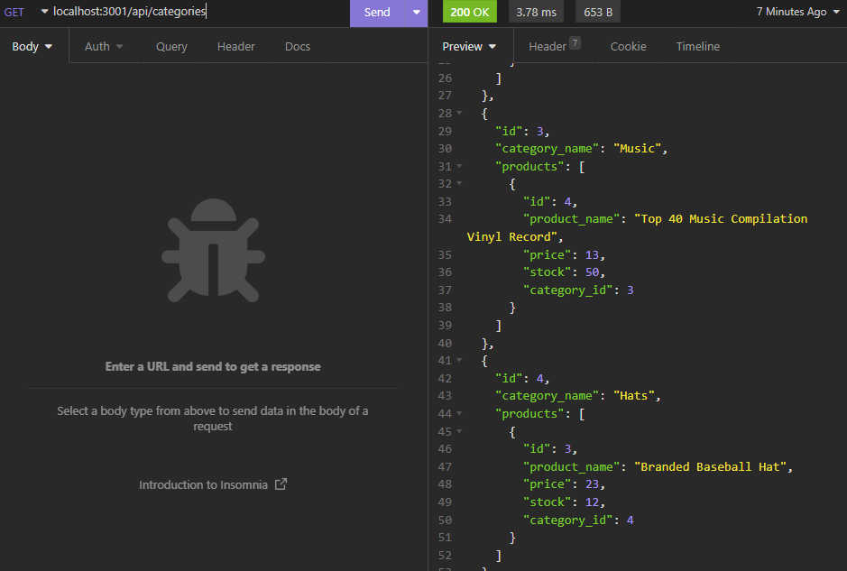

# ORM-E-commerce-BE

## Description
This project demonstrates backend applications for an E-commerce website.

## Usage
To use this project, the user must first run the proper sql file. 
Then the user must run the following, "npm run seed" and "npm run start", in the terminal.
After the previous steps are completed, the user can now use a visual database tool to view and edit the database.

## Walkthrough

Video walkthrough: https://drive.google.com/file/d/16ic-ewuQ1GLeygJ1tD0gBwkAlStXwZSl/view 

